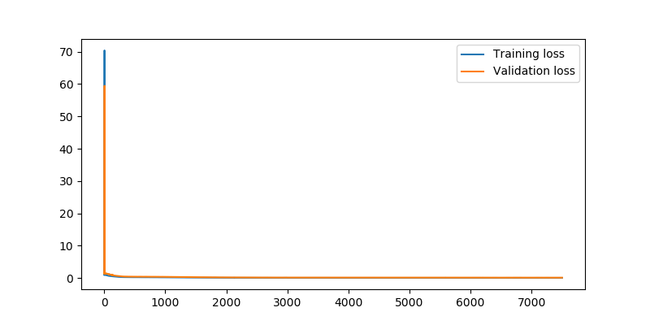
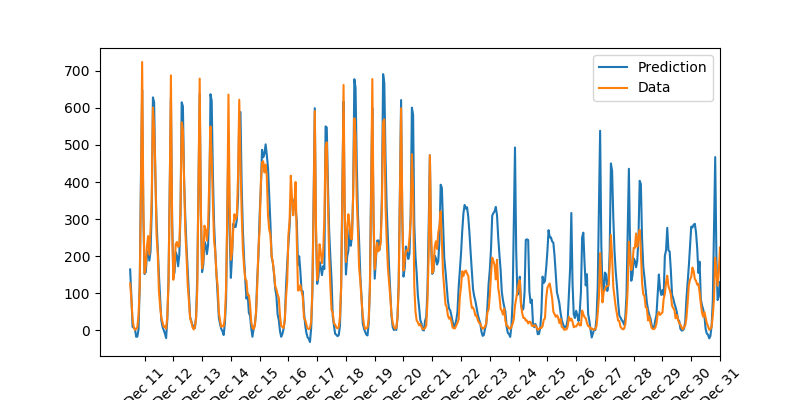

# Udacity Deep Learning — First Neural Network

Create and activate the env:

    conda create --name dlnd python=3
    source activate dlnd # mac osx

Install dependencies:

    conda install numpy matplotlib pandas jupyter notebook

Run the notebook:

    jupyter notebook dlnd-your-first-neural-network.ipynb

Run the neural network training script to batch hyperparameter combinations in one easy step:

    python neural_network_trainer.py

Find the following data lists and mess with them if you'd like to change things up:

    iterations = [1000, 2000, 3000, 4000, 5000, 7500, 10000]
    learning_rates = [0.5, 0.6, 0.7]
    hidden_nodes = [10, 15, 20, 25]

Check out all the nice charts in the `output` directory, such as:

See the `neural_network_notebook` for all other details!
